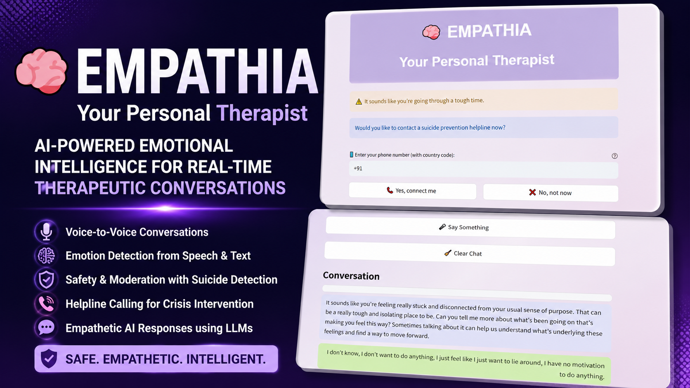

# 🧠 Empathia: AI-Driven Emotional Intelligence for Real-Time Therapeutic Conversations

<p align="center">
  <a href="YOUR_DEMO_VIDEO_LINK">
    
  </a>
</p>

<div align="center">


**A multimodal AI therapist capable of understanding emotions from both speech and text, generating empathetic responses, moderating unsafe outputs, and connecting users to suicide prevention helplines during crisis situations.**

</div>

---


## 🎥 Demo Videos

| Demo | Link |
|------|------|
| 🧠 Suicide Intervention Demo | ▶️ [Watch](https://drive.google.com/file/d/1xWJ0GBVBCoWYns7XgDb9MEP8xMLXKSeb/view?usp=drive_link) |
| ☎️ Suicide Helpline Calling Demo | ▶️ [Watch](https://drive.google.com/file/d/1YTwmBZe5FVeL_jwldi-eLSFxvCMmUSLX/view?usp=drive_link) |
| 💬 Normal Chat Demo | ▶️ [Watch](https://drive.google.com/file/d/1OaJRj3pN78QTD8fKtQFgDgcQKfKhkDoL/view?usp=drive_link) |


---

# 📌 Overview

Empathia is an AI-powered therapeutic conversational system that combines **speech emotion recognition**, **text emotion recognition**, **Large Language Models**, and **real-time crisis intervention** to provide emotionally intelligent conversations.

Unlike traditional chatbots, Empathia understands not only **what the user says** but also **how they say it**, enabling more empathetic and context-aware responses.

The system continuously monitors conversations for signs of suicidal ideation and can connect users directly with a suicide prevention helpline using Twilio.

---

# ✨ Features

- 🎤 Voice-to-Voice Conversations
- 😊 Speech Emotion Recognition
- 💬 Text Emotion Recognition
- 🤖 LLM-powered Therapist
- 🛡️ Response Moderation
- 🚨 Suicide Risk Detection
- ☎️ Automated Helpline Calling
- 🔊 Text-to-Speech Responses
- 📝 Conversation Summarization
- ⚡ FastAPI Backend
- 🌐 Streamlit Frontend

---

# 🏗️ System Architecture

```
User Speech
      │
      ▼
Speech-to-Text
      │
      ├───────────────┐
      ▼               ▼
Speech Emotion    Text Emotion
Classifier        Classifier
      │               │
      └──────┬────────┘
             ▼
      Emotion Fusion
             │
             ▼
      LangChain + Llama
             │
      ┌──────┴───────────┐
      ▼                  ▼
Moderation LLM     Suicide Detector
      │                  │
      └──────────┬───────┘
                 ▼
      Text-to-Speech
                 │
                 ▼
           User Response
```

---

# 🛠 Tech Stack

| Component | Technology |
|------------|------------|
| Frontend | Streamlit |
| Backend | FastAPI |
| Speech Recognition | Whisper |
| Speech Emotion | Wav2Vec |
| Text Emotion | DistilBERT |
| LLM | Llama 3.3 70B |
| Framework | LangChain |
| Crisis Calling | Twilio |
| Deployment | Ngrok |

---

# 📁 Project Structure

```
Empathia/

│
├── api.py
├── chatbot.py
├── predict.py
├── speech_classifier.py
├── text_classifier.py
├── Speech_Classifier.pth
├── text_classifier_model.pt
├── requirements.txt
├── Dockerfile
├── logfile.txt
│
├── uploaded_audio/
│
├── assets/
│   ├── thumbnail.png
│   ├── architecture.png
│   └── screenshots/
│
├── demo/
│   └── demo videos
│
└── README.md
```

---

# ⚙ Installation

## Clone Repository

```bash
git clone https://github.com/YOURUSERNAME/Empathia.git

cd Empathia
```

---

## Install Dependencies

```bash
pip install -r requirements.txt
```

---

## Configure Environment

Create a `.env` file

```env
GROQ_API_KEY=
TWILIO_ACCOUNT_SID=
TWILIO_AUTH_TOKEN=
TWILIO_PHONE=
NGROK_URL=
```

---

## Run Backend

```bash
uvicorn api:app --reload
```

---

## Run Frontend

```bash
streamlit run app.py
```

---

# 🧠 Model Architecture

### Speech Emotion Recognition

- Wav2Vec embeddings
- Custom classifier
- 8 emotion classes

### Text Emotion Recognition

- DistilBERT encoder
- Fully Connected classifier
- 6 emotion classes

### Conversational Agent

- LangChain
- Llama 3.3 70B
- Conversation Memory

### Safety Layer

- Moderation LLM
- Suicide Detection LLM
- Twilio Integration

---

# 🚨 Crisis Intervention

If suicidal intent is detected,

- the conversation is paused
- the user is asked for consent
- a phone number is requested
- Twilio automatically connects the user to a suicide prevention helpline

---

# 📊 Results

| Module | Accuracy |
|---------|-----------|
| Speech Emotion Recognition | 92% |
| Text Emotion Recognition | 93% |
| Suicide Detection | 9/10 cases |
| End-to-End Latency | ~9–10 seconds |

---

# ⚠ Limitations

- English only
- ~10 second response delay
- Requires internet
- Trial Twilio account supports verified numbers only
- Local deployment using Ngrok

---

# 🚀 Future Work

- Multi-language support
- Lower latency
- Better speech recognition
- Cloud deployment
- Improved emotion datasets
- Mobile application

---

# 📄 Project Report

Developed as part of the **M.Sc. Computer Science** programme at

**National Institute of Technology, Tiruchirappalli (2025–2026)**

Full report:

```
report/Empathia_Report.pdf
```

---

# 👤 Author

**Yuvraj Singh**

M.Sc. Computer Science

National Institute of Technology Tiruchirappalli

📧 yuvraj.singh.nitt@gmail.com

🔗 LinkedIn: [linkedin.com/in/yuvraj-singh-37a70b2a0](https://www.linkedin.com/in/yuvraj-singh-37a70b2a0)

---

